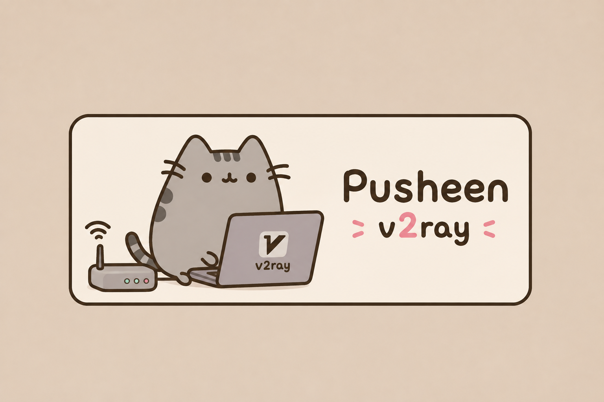
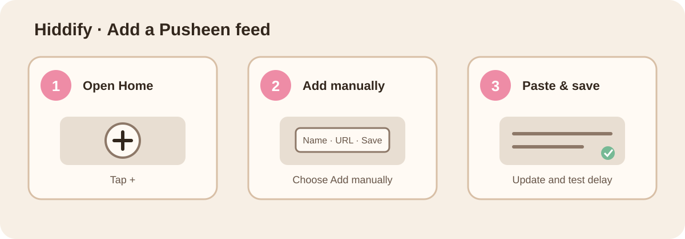
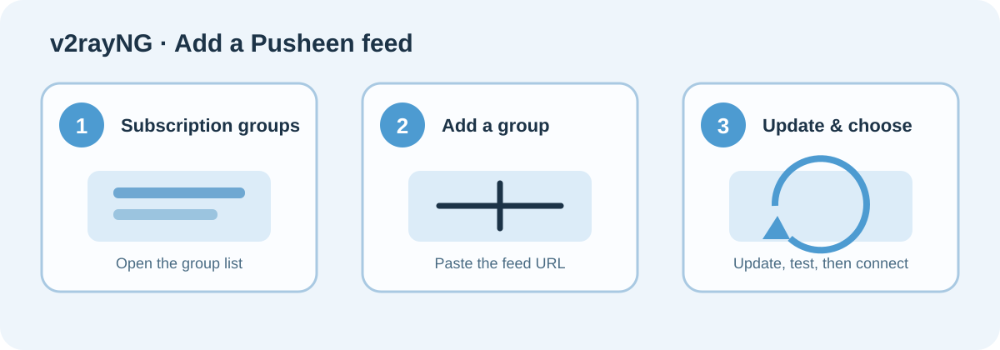
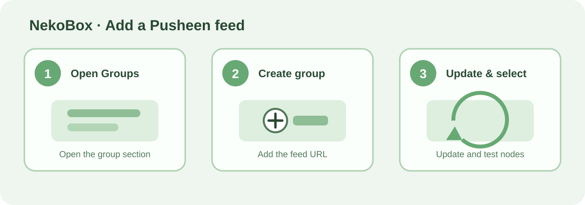
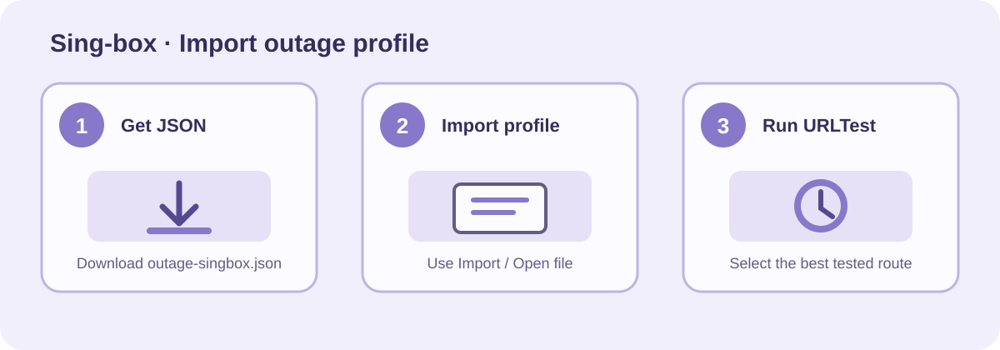

# Pusheen V2Ray

  

  <strong>پوشین تنبل، اما سریع  </strong> 
  فیدهای عمومی V2Ray و sing-box برای استفادهٔ ساده‌تر در شرایط ناپایدار اینترنت.

  <a href="README.en.md">English README</a> ·
  <a href="https://github.com/MahanKenway/Pusheen-V2Ray/actions">وضعیت اجرای خودکار</a> ·
  <a href="https://pusheen-feed-gateway.mahankenway.workers.dev/status.json">وضعیت زندهٔ فیدها</a>

> Pusheen V2Ray یک پروژهٔ عمومی و رایگان برای انتشار فیدهای بررسی‌شده است. هیچ فیدی تضمین اتصال در همهٔ شبکه‌ها یا زمان‌ها نیست؛ قبل از استفاده، چند لینک را در کلاینت خود آزمایش کنید.

## از کدام لینک استفاده کنم؟

برای **اختلال شدید و کاهش ریسک خرابی مشترک**، ابتدا `outage.txt` را امتحان کنید. این فید کوچک‌تر است، اما با تنوع بیشتر در source، پروتکل و transport انتخاب می‌شود. اگر تعداد بیشتری می‌خواهید، `resilient.txt` گزینهٔ دوم است. فیدهای `all.txt` و `balanced.txt` تعداد بیشتری دارند، اما گسترده‌ترند و الزاماً برای اختلال شدید بهینه نشده‌اند.

| اولویت | فید پیشنهادی | تعداد فعلی | مناسب برای | لینک پایدار مستقل از GitHub |
|---:|---|---:|---|---|
| 1 | Outage-diverse | 33 | شروع در اختلال شدید؛ کاهش تمرکز روی مسیرهای مشابه | [outage.txt](https://pusheen-feed-gateway.mahankenway.workers.dev/outage.txt) |
| 2 | Resilient | 53 | گزینهٔ وسیع‌تر با تنوع منبع، پروتکل و endpoint | [resilient.txt](https://pusheen-feed-gateway.mahankenway.workers.dev/resilient.txt) |
| 3 | Balanced | 250 | تعداد زیاد و انتخاب دستی بیشتر | [balanced.txt](https://pusheen-feed-gateway.mahankenway.workers.dev/balanced.txt) |
| 4 | Primary | 250 | بیشترین پوشش عمومی | [all.txt](https://pusheen-feed-gateway.mahankenway.workers.dev/all.txt) |
| 5 | Strict | 7 | نودهایی با evidence قوی‌تر؛ تعداد کمتر | [strict.txt](https://pusheen-feed-gateway.mahankenway.workers.dev/strict.txt) |

### لینک‌های جایگزین GitHub Raw

اگر Gateway برای شما باز نشد، می‌توانید از نسخهٔ Raw استفاده کنید: [outage](https://raw.githubusercontent.com/MahanKenway/Pusheen-V2Ray/main/subscriptions/outage.txt)، [resilient](https://raw.githubusercontent.com/MahanKenway/Pusheen-V2Ray/main/subscriptions/resilient.txt)، [balanced](https://raw.githubusercontent.com/MahanKenway/Pusheen-V2Ray/main/subscriptions/reachable.txt)، [all](https://raw.githubusercontent.com/MahanKenway/Pusheen-V2Ray/main/subscriptions/all.txt) و [strict](https://raw.githubusercontent.com/MahanKenway/Pusheen-V2Ray/main/subscriptions/strict.txt).

## لینک مخصوص sing-box و Hiddify

برای کلاینتی که **profile کامل sing-box** را می‌پذیرد، از [outage-singbox.json](https://pusheen-feed-gateway.mahankenway.workers.dev/outage-singbox.json) استفاده کنید. این فایل با URLTest و fallback محلی منتشر می‌شود. در Hiddify، اگر import فایل JSON به‌عنوان profile کامل در نسخهٔ شما پشتیبانی نشد، از [outage.txt](https://pusheen-feed-gateway.mahankenway.workers.dev/outage.txt) به‌عنوان subscription معمولی استفاده کنید؛ این سازگارترین گزینه است.

## وضعیت و زمان به‌روزرسانی

  
  

**🚀 برنامهٔ انتشار:** پایپلاین در دقیقه‌های **۰۷، ۲۲، ۳۷ و ۵۲ هر ساعت** اجرا می‌شود؛ یعنی حداکثر فاصلهٔ اسمی بین دو پنجرهٔ به‌روزرسانی ۱۵ دقیقه است. زمان واقعی انتشار به نتیجهٔ ingestion و validation همان اجرا بستگی دارد. برای مشاهدهٔ snapshot، تعداد فیدها و تازگی evidence، [status.json](https://pusheen-feed-gateway.mahankenway.workers.dev/status.json) را ببینید.

| وضعیت | لینک |
|---|---|
| آخرین وضعیت عمومی | [status.json](https://pusheen-feed-gateway.mahankenway.workers.dev/status.json) |
| release pointer | [current-release.json](https://pusheen-feed-gateway.mahankenway.workers.dev/current-release.json) |
| manifest نسخه‌دار | [current manifest](https://pusheen-feed-gateway.mahankenway.workers.dev/current-release.json) |
| صفحهٔ اجرای pipeline | [GitHub Actions](https://github.com/MahanKenway/Pusheen-V2Ray/actions) |
| بررسی beta sing-box | [Beta Compatibility](https://github.com/MahanKenway/Pusheen-V2Ray/actions/workflows/beta-compatibility.yml) |

## آموزش استفاده در کلاینت‌ها

آموزش‌های زیر تصویری و کوتاه هستند. لینک‌ها را از بخش بالا کپی کنید و در کلاینت خود به‌عنوان subscription وارد کنید. اگر یک فید به‌سرعت متصل نشد، ابتدا update بزنید و سپس نود دیگری را با delay کمتر انتخاب کنید.

### Hiddify — پیشنهاد اول برای استفادهٔ عمومی

در Hiddify از مسیر **Home → + → Add manually** بروید، لینک `outage.txt` یا `resilient.txt` را در URL قرار دهید، ذخیره کنید و سپس Update و delay test را اجرا کنید. Hiddify از subscriptionهای V2Ray و profileهای sing-box پشتیبانی می‌کند؛ برای profile کامل، [outage-singbox.json](https://pusheen-feed-gateway.mahankenway.workers.dev/outage-singbox.json) را فقط در نسخه‌ای وارد کنید که import فایل JSON را قبول می‌کند. راهنمای رسمی را در [Hiddify App documentation](https://hiddify.com/app/How-to-use-Hiddify-app/) بخوانید.

### v2rayNG — اندروید

در v2rayNG بخش subscription groups را باز کنید، یک group جدید بسازید، لینک `outage.txt` یا `resilient.txt` را وارد کنید، Update را بزنید و بعد یک نود را انتخاب کنید. برای پروژه و نسخه‌های رسمی، [مخزن v2rayNG](https://github.com/2dust/v2rayNG) را ببینید.

### NekoBox — اندروید

در NekoBox به بخش Groups بروید، group جدید بسازید، URL فید را وارد کنید و update بزنید. برای شروع در اختلال شدید، `outage.txt` را انتخاب کنید. راهنمای رسمی مرتبط را در [NekoBox tutorial](https://hiddify.com/manager/client-software-on-android/Tutorial-for-Nekobox-app/) و کد پروژه را در [NekoBoxForAndroid](https://github.com/MatsuriDayo/NekoBoxForAndroid) ببینید.

### sing-box — profile کامل

برای کلاینتی که profile کامل sing-box می‌پذیرد، فایل [outage-singbox.json](https://pusheen-feed-gateway.mahankenway.workers.dev/outage-singbox.json) را دانلود کنید، از گزینهٔ Import/Open file وارد کنید و URLTest را اجرا کنید. برای مستندات اصلی، [sing-box documentation](https://sing-box.sagernet.org/) را ببینید.

## نکات مهم اتصال

در اختلال شدید، یک فید واحد را معیار قطعی ندانید. ابتدا `outage.txt`، سپس `resilient.txt` و در نهایت `balanced.txt` را امتحان کنید. بعد از هر update، چند نود را با delay test بررسی کنید؛ delay پایین به‌تنهایی تضمین عبور از فیلترینگ یا پایداری طولانی‌مدت نیست.

فیدهای Pusheen بر اساس evidence زمان‌مند و وابسته به vantage اعتبارسنجی ساخته می‌شوند. تعداد بیشتر به معنی کارکرد تضمینی همهٔ نودها نیست و در خاموشی کامل اینترنت، هیچ لینک عمومی نمی‌تواند دسترسی را تضمین کند.

## مانیتورینگ و لینک‌های پروژه

| مورد | لینک |
|---|---|
| مخزن اصلی | [MahanKenway/Pusheen-V2Ray](https://github.com/MahanKenway/Pusheen-V2Ray) |
| Issues و گزارش خطا | [Issues](https://github.com/MahanKenway/Pusheen-V2Ray/issues) |
| Releaseهای versioned | [Releases](https://github.com/MahanKenway/Pusheen-V2Ray/releases) |
| تاریخچهٔ workflowها | [Actions](https://github.com/MahanKenway/Pusheen-V2Ray/actions) |
| Gateway health | [health](https://pusheen-feed-gateway.mahankenway.workers.dev/health) |
| وضعیت عمومی فیدها | [status.json](https://pusheen-feed-gateway.mahankenway.workers.dev/status.json) |

## English

برای نسخهٔ انگلیسی همین راهنما به [README.en.md](README.en.md) بروید.

## نسبت و مجوز

این پروژه تحت [MIT License](LICENSE) منتشر می‌شود. تصویر هدر توسط صاحب پروژه ارائه شده و برای هویت بصری همین مخزن استفاده می‌شود. نام و آثار Pusheen ممکن است متعلق به صاحبان حقوق مربوطه باشد؛ این مخزن ادعای مالکیت آن‌ها را ندارد.
